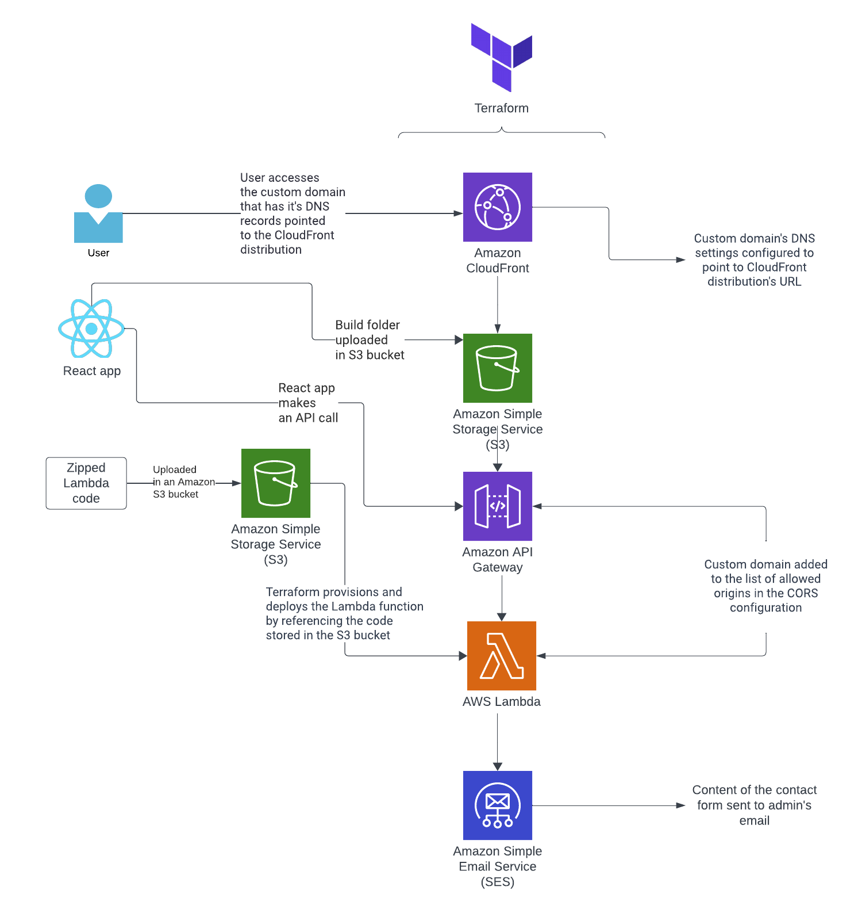

# AWS and Terraform-Powered Serverless Contact Form

This Terraform guide builds a serverless contact form for your website using AWS. Ditch the server, streamline deployment, and say hello to seamless email submissions!

This repository contains a straightforward frontend web application featuring a contact form optimized for AWS's serverless architecture. The implementation makes use of key AWS services such as Amazon Simple Email Service, AWS Lambda, API Gateway, S3, and CloudFront. Terraform is employed for efficient provisioning and management of the infrastructure, providing a seamless deployment and maintenance experience for your serverless contact form application on AWS.

Refer to the architecture diagram below for an overview:

##Frontend

The frontend application is developed using React and Mantine UI. It is easily extensible, allowing the addition of other pages alongside the contact form. Explore the frontend in the `frontend-react` directory.

## Serverless Backend

The contact form operates on a serverless backend. Data from the contact form is transmitted to an API Gateway, which then routes it to a Lambda function. The Lambda function utilizes Amazon Simple Email Service to forward the contact form contents to the specified email address.

## Terraform Modules

The `main.tf` file encompasses three modules. One module is responsible for creating frontend resources (S3, CloudFront), another for serverless backend resources (API Gateway, Lambda), and the third for enabling CORS for the API Gateway.

## API Gateway Resource

To use the API Gateway with a custom domain, update the origin address in the `main.tf` CORS module to your custom domain. Add your custom domain to the 'aliases' section in the `resource-api_gateway`. Obtain an SSL/TLS certificate using AWS ACM Certificate manually through the AWS console, and add the certificate ID to the `resource-api_gateway`.

## Lambda Resource

The Lambda code is located in the `aws-lambda` directory. To make this code functional, make the following changes:

- Adjust the region to your preferred region.
- Add your custom domain to 'Access-Control-Allow-Origin' (unless running the React app on localhost).
- Adjust source addresses accordingly.

Note: Email addresses must be added and approved via the AWS SES console for SES to use them.

## Setup

To run this project, install React, Mantine UI, AWS CLI, and Terraform.

## Deployment

Follow these steps to deploy the application. Note that these instructions are applicable when your application is deployed on a custom domain. For other setups, such as using a CloudFront URL, modify CORS settings and the deployment order accordingly. Alternatively, run the React application locally and leave CORS settings to the default 'http://localhost:3000'.

1. Create an S3 bucket in the AWS console or using AWS CLI. Upload the zipped Lambda code into the S3 bucket through the AWS console or AWS CLI. Reference the S3 bucket name in the Lambda resource code.

2. Create a Terraform Cloud workspace, and add the workspace name along with your organization name to `main.tf`. Run `terraform apply` to deploy resources, creating an S3 bucket, CloudFront distribution, API Gateway, and Lambda.

3. Update the React app's contact-form component with the URL of the AWS API Gateway. Build the React app using `npm run build`. Upload the contents of the build folder to the new S3 bucket created by Terraform, either through the AWS console or AWS CLI.

4. If using a custom domain, adjust the DNS settings of your custom domain to point to the CloudFront distribution.

